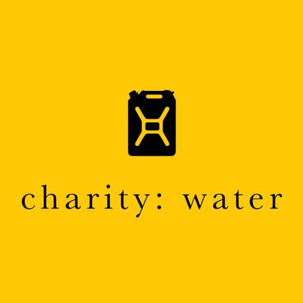
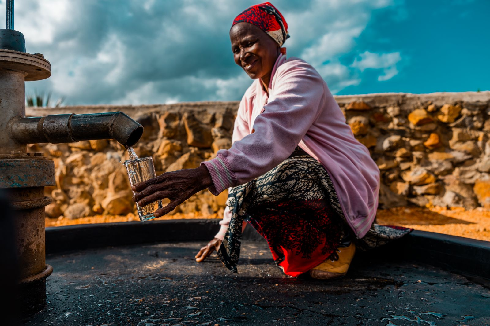

<!DOCTYPE html>
<html lang="en">
<head>
  <meta charset="UTF-8">
  <meta name="viewport" content="width=device-width, initial-scale=1">
  <title>Charity: Water Landing Page</title>
  
    </head>
    <body>   
      <header>
        

        <nav>
          <a href="#">Home</a>
          <a href="#">Our Impact</a>
          <a href="#">About Us</a>
          <a href="#">Discover More</a>
        </nav>
        <!-- Added cw.jpg centered next to the nav-links -->
        

          
        

      </header>
      <!-- Hero Section -->
      <section class="hero">
        <h1>Together, We Can End the Water Crisis</h1>
        
100% of your donation brings clean, life-changing water to people in need. Help a community. Change lives. Help kids and adults dream bigger — all because of monthly donors.

        
<strong>Millions of people</strong> are suffering without access to safe water. Donate to people in extreme need today.

        <a class="cta-button" href="#">Donate Now</a>
        <!-- Added Zimbabwe_2022_CG-0382.jpg under the donate now button -->
        

          
        

      </section>
